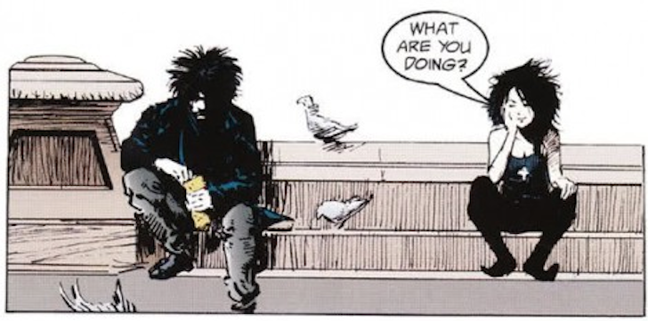

<div align="center">



# ~/.dotfiles

**My personal macOS development environment**

*Meticulously crafted configuration for a productive and beautiful terminal experience*

[](https://www.apple.com/macos/)
[](https://www.zsh.org/)
[](https://neovim.io/)
[](LICENSE)

<br>

[Features](#-features) •
[Installation](#-installation) •
[What's Included](#-whats-included) •
[Documentation](#-documentation) •
[Customization](#-customization)

<br>

<!-- Add your terminal screenshot here -->
<!--  -->

</div>

---

## Features

<table>
<tr>
<td width="50%">

### Terminal & Shell
- **ZSH** with [Zinit](https://github.com/zdharma-continuum/zinit) plugin manager
- **Parametrizable prompt** with [gitstatus](https://github.com/romkatv/gitstatus) (~47ms startup)
- **[Kitty](https://sw.kovidgoyal.net/kitty/)** GPU-accelerated terminal
- **[Tmux](https://github.com/tmux/tmux)** with [gpakosz/.tmux](https://github.com/gpakosz/.tmux) base

</td>
<td width="50%">

### Editor & Development
- **[Neovim](https://neovim.io/)** with Lua configuration
- **[lazy.nvim](https://github.com/folke/lazy.nvim)** plugin manager
- **LSP** with auto-install via [Mason](https://github.com/williamboman/mason.nvim)
- **[ASDF](https://asdf-vm.com/)** multi-language version manager

</td>
</tr>
</table>

### Highlights

| Feature | Description |
|---------|-------------|
| **Modular Design** | Organized configs with `zsh.d/` includes and flat structure |
| **One-Command Install** | Get up and running with a single `make` command |
| **Modern CLI Tools** | `bat`, `lsd`, `fd`, `ripgrep`, `fzf` aliases built-in |
| **Auto-Tmux** | Automatically attaches to tmux session on login |
| **Optimized Performance** | ~47ms ZSH startup with intelligent caching |

---

## Installation

> [!IMPORTANT]
> Review the code before running. These are **my** personal dotfiles designed for **macOS only**. Fork and customize!

### Prerequisites

- **macOS Ventura 13.0+** (Apple Silicon or Intel)
- **Git** (comes with Xcode Command Line Tools)

The Makefile will automatically check and install Xcode Command Line Tools if needed.

### Quick Start

```bash
# Clone the repository
git clone https://github.com/jcc-tck/.dotfiles.git ~/.dotfiles
cd ~/.dotfiles

# Verify system dependencies
make verify

# Install everything (automatic & autonomous)
make all
```

The `make all` command will:
1. ✓ Check & install Xcode Command Line Tools (if needed)
2. ✓ Install Homebrew package manager
3. ✓ Install ASDF version manager
4. ✓ Install core tools (Git, Tmux, Neovim)
5. ✓ Install CLI utilities (bat, lsd, fd, ripgrep, fzf, etc.)
6. ✓ Configure ZSH with Zinit + custom prompt
7. ✓ Configure Neovim with lazy.nvim + LSP
8. ✓ Configure Tmux with TPM (plugins)
9. ✓ Configure Git global settings
10. ✓ Install development tools (Node.js, Go, Terraform, Kubernetes)
11. ✓ Install Kitty terminal

### Step-by-Step Installation

If you prefer granular control:

```bash
# 1. Verify prerequisites
make verify

# 2. Install Homebrew (if not installed)
make brew

# 3. Install ASDF version manager
make asdf
source ~/.zshrc  # Activate ASDF

# 4. Install shell/editor configurations
make profile

# 5. Install development tools
make tools

# 6. Install Kitty terminal (optional)
make kitty
```

---

## What's Included

### Tech Stack

| Component | Tool | Description |
|:---------:|:----:|:------------|
|  | **[ZSH](https://www.zsh.org/)** | Shell with [Zinit](https://github.com/zdharma-continuum/zinit) plugins |
|  | **[gitstatus](https://github.com/romkatv/gitstatus)** | Ultra-fast parametrizable prompt (~47ms) |
|  | **[Kitty](https://sw.kovidgoyal.net/kitty/)** | GPU-accelerated terminal |
|  | **[Tmux](https://github.com/tmux/tmux)** | Terminal multiplexer |
|  | **[Neovim](https://neovim.io/)** | Modern Vim with LSP |
|  | **[ASDF](https://asdf-vm.com/)** | Version manager for everything |
|  | **[Homebrew](https://brew.sh/)** | macOS package manager |

### Repository Structure

```
~/.dotfiles/
├── Makefile                    # Unified installer (main + tools + profile)
├── README.md                   # This file - user-facing guide
├── CLAUDE.md                   # AI assistant guidance
├── HISTORY.md                  # Detailed changelog
├── zshrc                       # ZSH entry point → ~/.zshrc
├── zsh.d/                      # Modular ZSH → ~/.zsh.d/
│   ├── env.zsh                 # Environment & PATH (Homebrew, locale)
│   ├── plugins.zsh             # Zinit plugins (gitstatus, completions)
│   ├── prompt.zsh              # Custom parametrizable prompt
│   ├── alias.zsh               # Shell aliases (lsd, bat, git, tmux)
│   ├── tools.zsh               # Tool integrations (ASDF, fzf, zoxide)
│   ├── history.zsh             # History configuration
│   ├── options.zsh             # ZSH options
│   ├── completion.zsh          # Deferred completions
│   ├── colors.zsh              # Color configuration
│   └── kitty.zsh               # Kitty integration
├── nvim/                       # Neovim → ~/.config/nvim
│   ├── init.lua                # Entry point
│   ├── lazy-lock.json          # Plugin lockfile
│   └── lua/
│       ├── config/             # Options, keymaps, autocmds
│       └── plugins/            # LSP, treesitter, editor, completion
├── kitty.conf                  # Kitty terminal → ~/.config/kitty/kitty.conf
├── tmux.conf                   # Tmux config → ~/.tmux.conf
└── gitignore_global            # Global gitignore → ~/.gitignore_global
```

---

---

## Customization

<details>
<summary><strong>Change Color Theme</strong></summary>

All components are unified with **TokyoNight Night** theme:
- ✅ Kitty terminal
- ✅ Neovim editor
- ✅ Tmux status bar
- ✅ ls colors

To change to another theme:

**Neovim**: Edit `nvim/lua/plugins/editor.lua`
```lua
-- Change to Dracula
{
  "Mofiqul/dracula.nvim",
  lazy = false,
  priority = 1000,
  config = function()
    vim.cmd.colorscheme("dracula")
  end,
}
```

**Tmux**: Edit `tmux.conf` color values (lines 5-11)

**ls colors**: Run `~/.dotfiles/preview-ls-colors.sh` and edit `zsh.d/colors.zsh`
</details>

<details>
<summary><strong>Customize ZSH Prompt</strong></summary>

The prompt is fully parametrizable with 40+ configuration variables. Copy the example config and customize:

```bash
cp ~/.zsh.d/prompt.config.example ~/.zsh.d/prompt.config
vim ~/.zsh.d/prompt.config  # Edit colors, symbols, visibility
source ~/.zshrc
```

**Included presets**: Minimal, Nord, Dracula, Gruvbox, Solarized

See [zsh.d/prompt.config.example](zsh.d/prompt.config.example) for full documentation.
</details>

<details>
<summary><strong>Add ZSH Aliases</strong></summary>

Edit `zsh.d/alias.zsh`:

```bash
# Add your custom aliases
alias myalias='command here'
```
</details>

<details>
<summary><strong>Change ls Colors Theme</strong></summary>

Multiple color themes available for `ls` command. Preview them:

```bash
~/.dotfiles/preview-ls-colors.sh
```

Edit `zsh.d/colors.zsh` and uncomment your preferred theme:

```bash
# Available themes:
# - TokyoNight (default, matches Kitty)
# - Dracula (matches Neovim)
# - Nord
# - Gruvbox
# - Solarized

# Uncomment one:
export LSCOLORS=GxFxCxDxBxegedabagacad  # TokyoNight
# export LSCOLORS=FxGxCxDxBxegedabagacad  # Dracula
```

Apply: `source ~/.zshrc`
</details>

<details>
<summary><strong>Change Kitty Theme</strong></summary>

Edit `kitty.conf` and modify the color scheme section:

```conf
# =============================================================================
# Color Scheme - TokyoNight Night
# =============================================================================
# Change colors to your preferred theme
```
</details>

<details>
<summary><strong>Modify Tmux Configuration</strong></summary>

Edit `tmux.conf` directly to customize your tmux setup.
</details>

---

## Make Commands

### Main Commands

```bash
make help       # Show all available targets
make verify     # Verify system dependencies & configuration
make all        # Install everything (autonomous installation)
make brew       # Install Homebrew package manager
make asdf       # Install ASDF version manager
make profile    # Install all shell/editor configs
make tools      # Install all development tools
make kitty      # Install Kitty terminal
make clean      # Remove symlinked configurations
```

### Profile Configuration

```bash
make zsh        # Install ZSH configuration only
make neovim     # Install Neovim configuration only
make tmux       # Install Tmux configuration + TPM
make git        # Install Git global configuration
```

### Development Tools

```bash
make brew-tools  # Install essential CLI tools (tmux, nvim, bat, lsd, etc.)
make nodejs      # Install Node.js (latest stable)
make golang      # Install Go (latest stable)
make terraform   # Install Terraform (latest stable)
make kubernetes  # Install kubectl, helm, kind, kubectx
make docker      # Install Docker Desktop
make aws         # Install AWS CLI
make gcloud      # Install Google Cloud SDK
make azure       # Install Azure CLI
make list        # List all installed ASDF tools
make update      # Update ASDF and all plugins
```

---

## Validation & Troubleshooting

### System Verification

Before installation, verify your system meets all requirements:

```bash
make verify
```

This command checks:
- ✓ Xcode Command Line Tools
- ✓ macOS version and architecture
- ✓ Homebrew installation
- ✓ Git availability
- ✓ ZSH shell (default on macOS)
- ✓ Tmux, Neovim (after installation)
- ✓ ASDF version manager (after installation)

---

## Troubleshooting

<details>
<summary><strong>Reload configurations</strong></summary>

```bash
# ZSH
source ~/.zshrc

# Neovim plugins
nvim +"Lazy sync" +qa

# Tmux
tmux source-file ~/.tmux.conf

# Kitty (or press Cmd+Shift+,)
kill -SIGUSR1 $(pgrep kitty)
```
</details>

<details>
<summary><strong>Reset Neovim</strong></summary>

```bash
rm -rf ~/.local/share/nvim
rm -rf ~/.local/state/nvim
rm -rf ~/.cache/nvim
nvim  # Fresh start
```
</details>

<details>
<summary><strong>Profile ZSH startup time</strong></summary>

```bash
time zsh -i -c exit
```
</details>

---

## Documentation

| Document | Purpose |
|:---------|:--------|
| **[README.md](README.md)** | This file - user-facing setup guide for macOS |
| **[CLAUDE.md](CLAUDE.md)** | AI assistant guidance & development patterns |
| **[HISTORY.md](HISTORY.md)** | Detailed changelog with technical specifics |
| **[Makefile](Makefile)** | Complete installation automation (410+ lines) |

---

## Acknowledgments

Inspired by and built upon the work of:

- [gpakosz/.tmux](https://github.com/gpakosz/.tmux) - Tmux configuration
- [mathiasbynens/dotfiles](https://github.com/mathiasbynens/dotfiles) - macOS dotfiles inspiration
- [holman/dotfiles](https://github.com/holman/dotfiles) - Organization patterns
- [folke](https://github.com/folke) - Neovim plugin ecosystem

---

<div align="center">

**[Back to top](#dotfiles)**

Made with care by [Javier Coscolla](https://github.com/jcc-tck)

</div>
